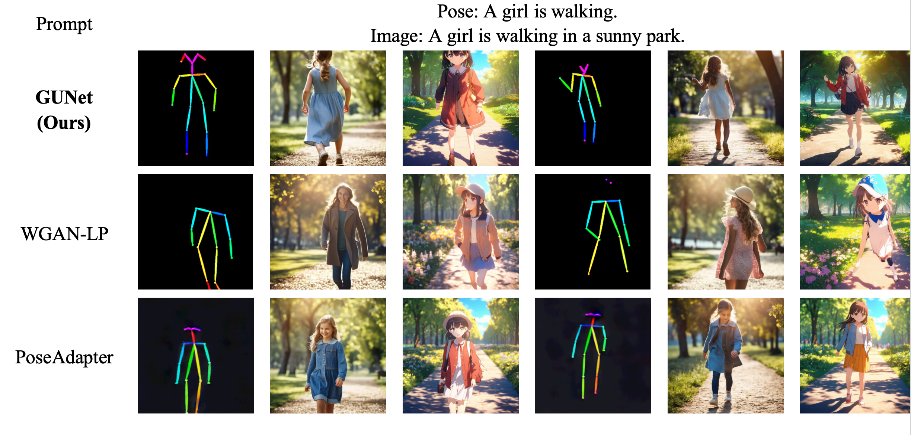
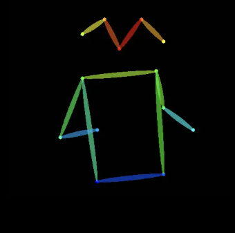
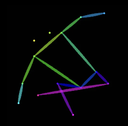
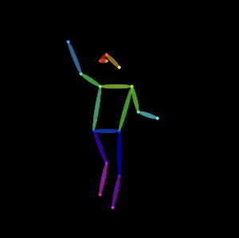
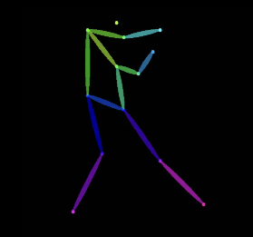

<h3><a href="">GUNET: A GRAPH CONVOLUTIONAL NETWORK UNITED DIFFUSION MODEL FOR STABLE AND DIVERSITY POSE GENERATION</a></h3>

<a href="https://huggingface.co/sw1125/gunet"></a>
<a href="https://arxiv.org/pdf/2409.11689"></a> 

Shuowen Liang*, Sisi Li*, Qingyun Wang, Cen Zhang, Kaiquan Zhu, Tian Yang

<p align="center">
 
</p>

## Brief Introduction
This is a model trained on the [diffusers](https://huggingface.co/docs/diffusers/index) framework that can generate 2D pose skeletons from generalized behaviour descriptions. It is used to enrich the guiding poses that can be used by pose controllable models such as ControlNet.
Compared with the [diffusers](https://huggingface.co/docs/diffusers/index) framework, we take the following measures to achieve independent prediction of key points in the 2D pose skeleton.
- We represent the 2D pose skeleton as a k-channel embedding, where **k** is the maximum number of key points.
- We change the input and output layers of the [UNet2DConditionModel](https://huggingface.co/docs/diffusers/api/models/unet2d-cond) in the diffusers framework from 4 channels to 17 channels to receive and output k-channel pose skeleton embeddings.
- In order to make the model understand the spatial distribution and inherent connections (skeleton) of human key points, we insert [Spatial Block](https://github.com/MCULab-sohu/PoseDiffusion/blob/main/utils/spatial_block.py) into [UNet2DConditionModel](https://huggingface.co/docs/diffusers/api/models/unet2d-cond) to introduce a k-node graph structure as a display modelling of the human skeleton. The unet model that introduces [Spatial Block](https://github.com/MCULab-sohu/PoseDiffusion/blob/main/utils/spatial_block.py) is called [GUNet](https://github.com/MCULab-sohu/PoseDiffusion/blob/main/model.py).
The following shows the effect of our model on some common daily behavior descriptions.
***
| A girl is eating an apple.  | A man is riding a surfboard on top of a wave in the ocean.| There's a person flying a kite next to a tree. | A man standing on a tennis court holding a racquet and a ball. |
|  :---:  |  :---:  |  :---:  |  :---: |
|  |  |  | |

<p align="center">
<a href="">Towards GUNet with an Improved Diffusers Pipeline</a>       
</p>

***

## Release

- [2024/11/25]🔥🔥🔥 We open-source the codes and weights.
- [2024/11/19]🔥🔥🔥 We release the PoseDiffusion model GUNet!
- [2024/9/18]🔥🔥🔥The paper can be found in this [repo](https://github.com/MCULab-sohu/PoseDiffusion/blob/main/arxiv_0918.pdf). We also have submitted it to Arxiv. 


[](https://github.com/tatsu-lab/stanford_alpaca/blob/main/LICENSE)
[](https://github.com/tatsu-lab/stanford_alpaca/blob/main/DATA_LICENSE)


## Contents
- [Install](#install)
- [GUNet Weights](#gunet-weights)
- [Data Processing](#data-processing)
- [Train](#train)
- [Inference](#inference)
- [Quick Start](#quick-start)


## Install
0. Our environment is cuda12.1+torch2.4.1
1. Clone this repository and navigate to the PoseDiffusion folder
```bash
git clone https://github.com/MCULab-sohu/PoseDiffusion.git
cd 'the PoseDiffusion folder'
```
2. Install Package
```Shell
conda create -n gunet python=3.10.13 -y
conda activate gunet
pip install -r requirements.txt
```

## GUNet Weights
- [Huggingface](https://huggingface.co/sw1125/gunet)
- [Colab](https://drive.google.com/drive/folders/1Pu3oZmmlrimK7heC66ZawG6QtKHPXJY7?usp=sharing)


Put the downloaded weights under the file **trained**
## Data Processing
- The processed training data can be obtained [here](https://drive.google.com/drive/folders/1fU82JtvWrgdT9udw_7oapvm-WtYQbF8W?usp=drive_link), including **joint_vectors** and **texts** of each pose.
- The original data can be obtained from [here](https://drive.google.com/drive/folders/1fU82JtvWrgdT9udw_7oapvm-WtYQbF8W?usp=drive_link).
- If you want to train from scratch, you need to process the data into json format.
**Data format**:
```Shell
{"image_path": "/joint_vectors/0.npy","text": "a big red telephone booth that a man is standing in"},
{"image_path": "/joint_vectors/1.npy","text": "A black and white image of a man in a suit wearing glasses walking through a door."}
```
- You can also use [generate_heatmap.py](https://github.com/MCULab-sohu/PoseDiffusion/tree/main/data_process) to process your data.
- If you want to see the representation of each pose, you can run [train_data.ipynb](https://github.com/MCULab-sohu/PoseDiffusion/tree/main/data_process).

## Train

```Shell
python3 main.py -mode train -epoch 1000 -save_path /your save path 
```

## Inference

 ```Shell
python3 main.py -mode sample --prompt 'A girl is drinking coffee.' -negative_prompt ' ' -height 256 -width 256 -num_images_per_prompt 1 -sample_image_save_path /your image save path
```

## Quick Start
- You can download the project directly and run the notebook [gunet.ipynb](https://github.com/MCULab-sohu/PoseDiffusion/blob/main/gunet.ipynb) or script [quick-start.py](https://github.com/MCULab-sohu/PoseDiffusion/blob/main/quick-start.py) in the project.
- If you have problems downloading weights from [huggingface](https://huggingface.co/sw1125/gunet), you can download the model weights from [colab](https://drive.google.com/drive/folders/1Pu3oZmmlrimK7heC66ZawG6QtKHPXJY7?usp=sharing) and save them in the folder **trained**, then run [gunet.ipynb](https://github.com/MCULab-sohu/PoseDiffusion/blob/main/gunet.ipynb) or [quick-start.py](https://github.com/MCULab-sohu/PoseDiffusion/blob/main/quick-start.py).
- The following is the content of [quick-start.py]((https://github.com/MCULab-sohu/PoseDiffusion/blob/main/quick-start.py)).

**Note**: **pipeline** and **model** are customized and need to be downloaded from this [project](https://github.com/MCULab-sohu/PoseDiffusion).
```ruby
from pipeline import G_StableDiffusionPipeline
from model import GUNet2DConditionModel
from utils.draw_pose import *


device = "cuda"
# if use huggingface
model = G_StableDiffusionPipeline.from_pretrained('sw1125/gunet',safety_checker=None).to(device)
gunet = GUNet2DConditionModel.from_pretrained('sw1125/gunet',subfolder="unet",safety_checker=None).to(device)
model.unet = gunet

# if download the checkpoint
# model = G_StableDiffusionPipeline.from_pretrained('/trained/save_1000',safety_checker=None).to(device)
# gunet = GUNet2DConditionModel.from_pretrained("/trained/save_1000/unet").to(device)
# model.unet = gunet

text = 'A man riding a surfboard on top of a wave in the ocean.'

num_images = 1

output = model(prompt=text,negative_prompt=None,height=256,width=256,num_inference_steps=27,num_images_per_prompt=num_images)
for im in range(num_images):
    image = output[0][im]
    keypoint_coor = get_coor(image)
    subset = get_subs(channel_num=17, coordinates=keypoint_coor)
    canvas = draw_bodypose(np.array(keypoint_coor), np.array([subset]))
    canvas = np.array((canvas - np.min(canvas)) / (np.max(canvas) - np.min(canvas)))
    plt.imsave((f"./samples/{im}.png"), canvas[:, :, [2, 1, 0]])
```
## Contact
If you are interested in this work or have questions about the code or the paper, please send an email to [Email](shuowenliang011111@sohu-inc.com).


## Acknowledgement
- [Diffusers](https://huggingface.co/docs/diffusers/index): the codebase we built upon!


## Citation
```bibtex
@article{liang2024gunet,
  title={GUNet: A Graph Convolutional Network United Diffusion Model for Stable and Diversity Pose Generation},
  author={Liang, Shuowen and Li, Sisi and Wang, Qingyun and Zhang, Cen and Zhu, Kaiquan and Yang, Tian},
  journal={arXiv preprint arXiv:2409.11689},
  year={2024}
}


